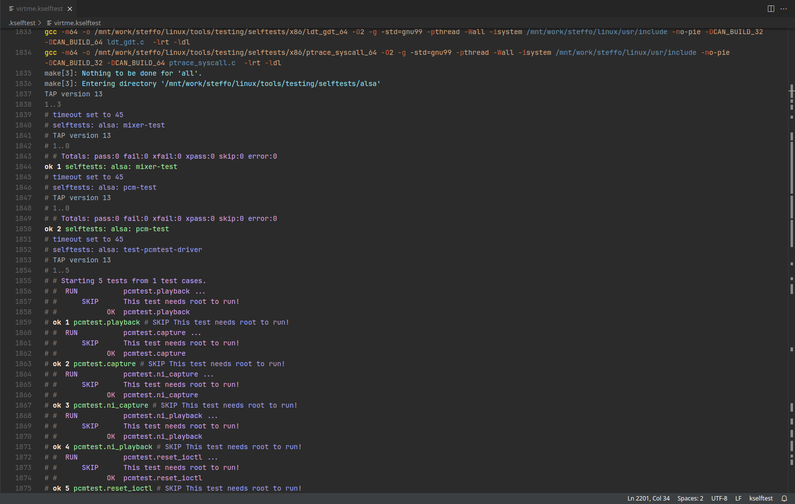

<div align="center">


# kselftesthighlight

Syntax highlighting for kselftest output

</div>

## Links

[](https://marketplace.visualstudio.com/items?itemName=steffo.kselftest)
 
[](https://open-vsx.org/extension/steffo/kselftest)


## Usage

This extension expects files to be generated with:

```shell
make kselftest | tee output.kselftest
```

> [!Note]
>
> The scopes used by this extensions are unlikely to be implemented in most color schemes; for best results, make sure to use [Steffula Code](https://github.com/Steffo99/steffula-code) as your color theme!

## Screenshots


